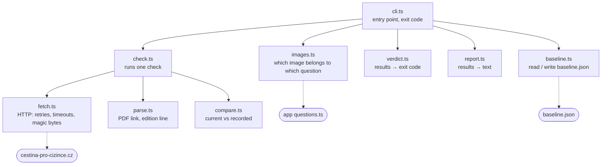

# @kviz/monitor

Checks whether the official question bank has changed since we last looked.

The quiz data is a snapshot of a source that keeps moving. Nothing used to notice when it
moved, which is why questions showed 404s for months and one still shows four portraits of
Czech presidents instead of the National Theatre.

## How a run works

```
baseline.json ──┐
                ├──→  check.ts  ──→  CheckResult[]  ──┬──→  verdict.ts  ──→  exit 0 / 1 / 2
source site  ───┘                                     └──→  report.ts   ──→  text
```



| File | Takes | Gives back |
|---|---|---|
| `fetch.ts` | a URL | bytes, headers, or a reason it failed — never throws |
| `parse.ts` | page HTML, PDF text | the PDF link; the edition line and topic count |
| `compare.ts` | current facts + the recorded ones | one `CheckResult` per item |
| `verdict.ts` | all results | an exit code, worst outcome winning |
| `report.ts` | all results | the text a human reads |
| `check.ts` | the baseline | wires fetch → parse → compare together |
| `images.ts` | the app's questions | every hotlinked URL, and which question uses it |
| `baseline.ts` | — | reads and writes `baseline.json` |

Functions rather than classes on purpose: every step takes data and returns data, so each
one is testable without the network, and there is no state worth wrapping in an object.

## Use

```bash
npm run monitor -w @kviz/monitor          # compare against baseline.json
npm run monitor:record -w @kviz/monitor   # record the current state as the new baseline
```

`--record` is deliberate, never scheduled: it blesses whatever the source is serving today.

## Exit codes

| Code | Meaning |
|---|---|
| 0 | verified, nothing changed |
| 1 | drift — the source changed |
| 2 | could not verify — the check itself failed |

`2` outranks `1`. If one item could not be checked, the run cannot claim the others are
fine either.

## What it checks

| Signal | Why |
|---|---|
| PDF link on the databanka page | The URL encodes the publication date. Superseded URLs keep returning 200 forever, so a hardcoded one would look unchanged indefinitely |
| `Vydání ... Aktualizováno` line | Survives trivial re-saves that would change a file hash. Tested against editions from 2021 to 2026 |
| 30 topics | Catches a restructure |
| 32 hotlinked images | Image drift does not follow republication: the `17alt*` files were swapped three weeks before the 2026 edition |

## Cost to the source

Images are checked with HEAD and downloaded only when the server's validators move, so a
clean run is about 40 requests carrying almost nothing. Requests are sequential and
identify themselves in the User-Agent. `robots.txt` permits the page fetch.

## baseline.json

One record per image, plus the source. `knownBad` marks something already wrong that we
have chosen not to fix yet — reported on every run, but not counted as new drift, so the
workflow does not sit permanently red.

```json
{
  "source": { "pdfUrl": "...", "edition": "...", "updatedAt": "...", "topicCount": 30 },
  "images": {
    "https://.../17alt1.jpg": {
      "etag": "...", "lastModified": "...", "contentLength": "...",
      "sha256": "...", "bytes": 146307,
      "knownBad": { "reason": "shows a president, not the theatre", "since": "2025-12-15" }
    }
  },
  "checkedAt": "2026-08-01T18:22:00.000Z"
}
```

`checkedAt` is committed by the workflow each month, so a check that stopped running shows
up as a stale date rather than as silence.
